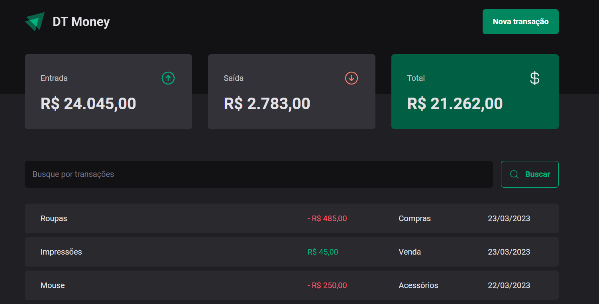

# DT Money

## Tópicos 

[Sobre o dt money](#sobre-o-dt-money)

[Tecnologias](#tecnologias)

[Instalação e uso](#instalação-e-uso)

<br>

## Sobre o dt money

O DT Money é uma alternativa simples e eficaz para gerenciar suas finanças, permitindo o cadastro de entradas, saídas e a organização das mesmas em categorias.

<br>

<p align="center">
  
</p>

## Tecnologias

Tecnologias e ferramentas utilizadas no desenvolvimento do projeto:

- [React](https://reactjs.org/)
- [TypeScript](https://www.typescriptlang.org/)
- [Styled Components](https://styled-components.com/)
- [Axios](https://github.com/axios/axios)

<br>

## Instalação e uso

```bash
# Abra um terminal e copie este repositório com o comando
git clone https://github.com/iurioliveira914/dt-money
# ou use a opção de download.

# Entre na pasta web com 
cd dt-money

# Instale as dependências
npm install

# Rode a aplicação
npm run dev
```

<br>
